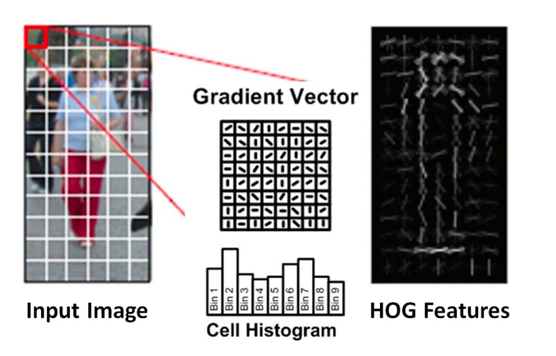

# Pedestrian Detection Using HOG Method in MATLAB

This project aims to develop a pedestrian detection method from still images using the Dalal and Triggs method. This approach introduces Histograms of Oriented Gradients (HOG) to characterize the silhouettes of standing persons in the images.

## Project Overview

Pedestrian detection is a critical task in computer vision with applications in surveillance, autonomous driving, and robotics. This project focuses on implementing the HOG method for detecting pedestrians in static images using MATLAB.

## Methodology

The method introduced by Dalal and Triggs utilizes Histograms of Oriented Gradients (HOG) to effectively describe the shape and appearance of human figures. The steps involved in this project include:

1. **Feature Extraction**: Computing HOG descriptors for the input images.

<div align="center">
  
</div>

2. **Training**: Using a dataset provided by the authors to train a classifier.
3. **Detection**: Applying the trained model to detect pedestrians in test images.

## Dataset

We will use the dataset provided by the authors, available at [INRIA Person Dataset](http://pascal.inrialpes.fr/data/human/). This dataset contains thousands of images, both with and without pedestrians. A portion of the positive images has been normalized to create training and testing sets. These images are 64x128 pixels and show centered persons.

## Installation

To run this project, ensure you have MATLAB installed. The following MATLAB toolboxes are required:

- Image Processing Toolbox
- Statistics and Machine Learning Toolbox

## Usage

1. Clone this repository:

```bash
git clone https://github.com/your-username/pedestrian-detection-hog-matlab.git
cd pedestrian-detection-hog-matlab
```

2. Prepare the dataset by downloading it from the provided link and placing it in the `data` directory.

3. Open MATLAB and navigate to the project directory.

4. Run the `main.m` script to train the model and extract the features


## Results

The project aims to achieve pedestrian detection using the HOG method. Example results and performance metrics will be provided in the results directory.

Due to the lack of data, the tests were conducted on the training images, which does not present a real evaluation of the model's capabilities on unseen images.

## References

- Navneet Dalal and Bill Triggs, "Histograms of Oriented Gradients for Human Detection," IEEE Computer Society Conference on Computer Vision and Pattern Recognition (CVPR), 2005.

## License

This project is licensed under the MIT License. See the `LICENSE` file for more details.

---
